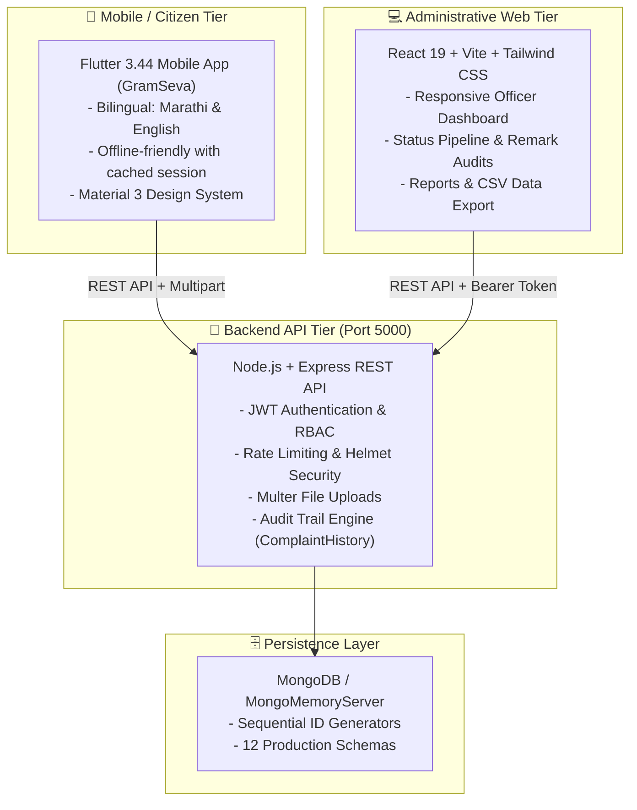

# 🏛️ Yewla Gram Panchayat Citizen Service & Management System (GramSeva)
### येवला ग्रामपंचायत नागरिक सेवा व तक्रार निवारण प्रणाली

A production-ready, full-stack citizen service and administrative governance platform built for **Yewla Gram Panchayat** (Jalna District, Maharashtra). The platform bridges the gap between rural citizens and local administration, offering transparent grievance redressal, certificate requests, scheme enrollment, emergency directories, and real-time public announcements.

---

## 🌟 Architectural Overview



---

## 🔑 Pre-Seeded Demo Credentials

| Role | Email / Username | Password | Access Level |
| :--- | :--- | :--- | :--- |
| **Panchayat Admin** (सरपंच / ग्रामसेवक - युवराज जाधव) | `jshivraj028@gmail.com` (or `7666718978`) | `Pass@123` | Full control: Users, complaints, notices, schemes, projects, reports |
| **Field Staff** (कर्मचारी / अभियंता) | `staff@yewlagp.in` | `StaffPassword123!` | Update complaint status, add remarks, review service applications |
| **Citizen 1** (नागरिक - गणेश मोरे) | `citizen@yewlagp.in` (or `9876543210`) | `CitizenPassword123!` | Mobile app: File complaints, track status, apply for certificates |
| **Citizen 2** (नागरिक - पूजा शिंदे) | `pooja@yewlagp.in` (or `9823456780`) | `CitizenPassword123!` | Mobile app: Track ward requests, view public notices & schemes |

---

## 📁 Repository Structure

```
├── backend/                       # Node.js + Express REST API
│   ├── src/
│   │   ├── config/                # DB connection (with MongoMemoryServer auto-fallback)
│   │   ├── controllers/           # 12 REST controllers (Complaints, Notices, Users, etc.)
│   │   ├── middleware/            # JWT auth, RBAC authorization, upload, errors
│   │   ├── models/                # 12 Mongoose models with indexes & pre-save hooks
│   │   ├── routes/                # Express routing definitions
│   │   ├── seeds/                 # Realistic Yewla GP dataset seeders
│   │   ├── test/                  # Supertest automated integration test suite
│   │   ├── app.js                 # Express application setup
│   │   └── server.js              # Server entry point (Port 5000)
│   └── package.json
│
├── admin-panel/                   # React 19 + Tailwind CSS Web Dashboard
│   ├── src/
│   │   ├── components/            # Sidebar, Navbar, StatCard, StatusBadge
│   │   ├── context/               # AuthContext with token persistence
│   │   ├── pages/                 # 13 Dedicated administrative management pages
│   │   ├── services/              # Axios instance with 401 interception
│   │   ├── App.jsx                # Protected routes & responsive layout shell
│   │   └── main.jsx
│   ├── vite.config.js
│   └── package.json
│
└── citizen_app/                   # Flutter 3.44 (Dart 3.12) Mobile Application
    ├── lib/
    │   ├── core/                  # Theme, constants, network client, bilingual dictionary
    │   ├── models/                # Type-safe Dart models matching API schemas
    │   ├── providers/             # ChangeNotifier state management
    │   ├── services/              # HTTP API service layer
    │   ├── screens/               # 20+ Screens (Complaints, Timeline, Schemes, Notices)
    │   ├── widgets/               # Reusable cards, status chips, timeline steps
    │   └── main.dart
    ├── pubspec.yaml
    └── analysis_options.yaml
```

---

## 🚀 Quick Start Guide

### 1. Start Backend API Server
```powershell
cd backend
npm install
npm run dev
```
> **Note on MongoDB**: If a local MongoDB instance (`mongodb://127.0.0.1:27017/yewla_gp`) is not running, the backend will **automatically initialize an embedded MongoMemoryServer** and seed the full dataset with no extra configuration needed! Server starts at `http://localhost:5000`.

To run backend automated integration tests:
```powershell
npm test
```

---

### 2. Start Admin Web Dashboard
```powershell
cd admin-panel
npm install
npm run dev
```
- Open `http://localhost:5173` in your browser.
- Click **"Admin Login"** or **"Staff Login"** for one-click demo credentials fill.
- Production build validation: `npm run build`

---

### 3. Run Citizen Mobile App
```powershell
cd citizen_app
flutter pub get
flutter run -d chrome     # Run on Web browser
# or
flutter run               # Run on Android Emulator / Physical Device
```
> **Emulator vs Web Base URL**: The Flutter app automatically switches API hosts:
> - Web / Desktop: `http://localhost:5000/api`
> - Android Emulator: `http://10.0.2.2:5000/api`

To verify Flutter code health:
```powershell
flutter test
flutter analyze
```

---

## 📋 Comprehensive Features Checklist

### 1. Citizen Mobile Application (Flutter)
- [x] **Bilingual Localization**: Instant Marathi (मराठी) and English toggling across all screens with native Devanagari terminology.
- [x] **Authentication & Onboarding**: Mobile OTP / password sign-in, citizen registration with Ward selection (1 to 10), and 3-step informative onboarding.
- [x] **Complaint Redressal (तक्रार निवारण)**:
  - Categorized filing (Water Supply, Roads, Street Lights, Sanitation, Drainage, Health, Tax).
  - Photo attachment via camera or gallery with real-time preview.
  - Auto-generated sequential tracking ID (e.g., `GP-CMP-000004`).
  - **Live Audit Timeline**: Visual vertical step progress showing submission, assignment to staff, and resolution with timestamped officer remarks.
- [x] **Service & Certificate Requests (दाखले व सेवा)**: Applications for Birth/Death certificates, Residence certificates, No Objection (NOC), and Property extracts (8-A/7-12).
- [x] **Public Notices & Gram Sabha**: Real-time push notices, urgent circulars, and scheduled Gram Sabha agendas with downloadable attachments.
- [x] **Government Schemes (शासकीय योजना)**: Central & State schemes (PMAY, PM-Kisan, Sanjay Gandhi Niradhar, Mahila Bachat Gat) with eligibility criteria, benefit amounts, and documents checklist.
- [x] **Development Projects (विकासकामे)**: Transparent view of village infrastructure projects, allocated budget, contractor, progress percentage, and completion milestones.
- [x] **Emergency Contacts Directory**: One-touch speed dialing for Police, Rural Hospital, Fire Brigade, Electricity board, Water supply engineer, and Sarpanch office.
- [x] **Village Photo Gallery**: Visual showcase of village achievements, tree plantation drives, and Gram Sabha meetings.

### 2. Administrative Web Dashboard (React + Vite)
- [x] **Analytics & KPI Cards**: Active complaints, resolution turnaround %, pending requests, registered citizens, active development works.
- [x] **Complaint Management Workflow**:
  - Filter by status, category, ward, and search by tracking ID or citizen phone.
  - Assign complaints to field officers.
  - Update progress status (`Pending` -> `Under Review` -> `Assigned` -> `In Progress` -> `Resolved` / `Rejected`) with mandatory officer remarks.
  - Photo attachment viewer with modal zoom.
- [x] **Service Applications Processing**: Approve or reject certificates with official remarks.
- [x] **Notices & Circulars Publisher**: Create urgent notices with validity dates and attach public documents.
- [x] **User & Staff Directory**: Manage citizen accounts, toggle active/inactive status, and upgrade roles (`citizen` -> `staff` -> `admin`).
- [x] **Reports & CSV Data Export**: Filterable grievance audit report generator with one-click `.csv` spreadsheet export.
- [x] **Panchayat Settings**: Manage official contacts, office timings, public grievance redressal hours, and elected representatives directory.

---

## 🔒 Security & Best Practices
- **Role-Based Access Control (RBAC)**: Strictly enforced at backend API middleware (`citizen`, `staff`, `admin`).
- **Password Hashing**: Salted Bcrypt hashing with pre-save Mongoose hook.
- **Audit Logging**: Every status transition generates an immutable `ComplaintHistory` entry with the acting officer's ID and timestamped remarks.
- **Sequential IDs**: Automated atomic sequence generation for human-readable IDs (`GP-CMP-xxxxxx`, `GP-REQ-xxxxxx`).
- **HTTP Protection**: Configured with `helmet`, CORS policy, and `express-rate-limit`.

---

## 🏛️ Yewla Gram Panchayat Office Information
- **Panchayat Bhavan**: Main Market Road, Yewla, Dist. Jalna, Maharashtra - 423401
- **Helpline**: `02559-222100` | **Email**: `contact@yewlagp.in`
- **Office Timings**: Monday to Saturday, 09:30 AM – 05:30 PM
